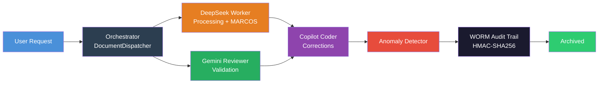

# Sovereign Accounting AI Agent

[](https://www.python.org/)
[](https://fastapi.tiangolo.com/)
[](https://opensource.org/licenses/MIT)
[](https://www.docker.com/)
[](https://www.planalto.gov.br/ccivil_03/_ato2015-2018/2018/lei/l13709.htm)
[]()
[]()

**Enterprise-grade multi-agent AI system for Brazilian accounting automation.**

922 Python modules | 23+ document types | LGPD compliant | Post-quantum cryptography ready

---

## Why This Exists

Brazil has one of the world's most complex tax systems — companies must file 20+ different tax, labor, and social security declarations monthly to multiple government agencies, each with unique formats and validation rules. This system **automates that entire pipeline**: classifying documents by type, extracting structured data with LLMs, computing tax obligations, validating against government specs, and archiving with tamper-proof audit trails.

> 💡 **For non-Brazilian readers**: Think of this as automating the equivalent of IRS tax filing + payroll compliance + social security reporting — but for a system 5x more complex than the US, with real-time government portal integration via RPA.

---

## Architecture



### Multi-Agent Pipeline

```
User Request → Orchestrator (DocumentDispatcher, 23 doc types)
  → DeepSeek Worker (processing with MARCOS persona)
  + Gemini Reviewer (validation)
  → Copilot Coder
  → Anomaly Detector
  → WORM Audit Trail (HMAC-SHA256)
```

### 7-State Finite State Machine

```
RECEIVED → CLASSIFYING → PROCESSING → REVIEWING → CORRECTING → DISPATCHING → ARCHIVED
```

---

## Core Capabilities

### 📄 Document Intelligence
- 23+ Brazilian document types (DIRF, GFIP, SPED, DCTF, PER/DCOMP, e-Social, and more)
- NLP classification and structured extraction
- Persona-based prompt engineering (MARCOS)

### 🤖 RPA Automation
- Playwright-based FGTS retrieval from Caixa Econômica Federal
- Captcha handling and session management
- SHA256 PDF verification
- Celery batch processing

### 🔒 Security
- **LGPD** PII anonymization (CPF, CNPJ, name, email)
- **WORM audit** with HMAC-SHA256 integrity
- **HashiCorp Vault** for secrets management
- **mTLS** for inter-agent communication
- **RBAC** role-based access control
- **PQC hooks** (Kyber/Dilithium) — post-quantum ready
- Digital signatures with anomaly detection

### 🧮 Accounting Engine
- FGTS, INSS, IRRF, 13th salary, termination, vacation calculations
- PDF AcroForm generation
- YAML-driven tax rules and compliance checks

### 🛡️ Resilience
- Circuit breaker with configurable thresholds
- Exponential backoff and timeout management
- Graceful degradation under failure

---

## Tech Stack

| Layer | Technologies |
|-------|-------------|
| **API** | FastAPI + Flask |
| **Tasks** | Celery + Redis |
| **Database** | SQLite WAL |
| **RPA** | Playwright |
| **LLMs** | DeepSeek, Gemini, Copilot |
| **Crypto** | HMAC-SHA256, Kyber, Dilithium |
| **Secrets** | HashiCorp Vault |
| **Transport** | mTLS |
| **Monitoring** | Prometheus |
| **CI/CD** | GitHub Actions |
| **Container** | Docker + Docker Compose |

---

## Project Structure

```
contabil_agente/          # Main agent
├── agent_contabil.py     # Core agent logic (370L)
├── governance_manager.py # Audit governance (596L)
├── orchestrator/
│   └── main.py           # Document dispatcher (829L)
├── tools/
│   ├── sovereign_rpa_worker.py  # RPA engine (841L)
│   ├── base_sovereign.py        # Base tool class (228L)
│   └── calculo_tool.py          # Tax calculator (49KB)
└── middleware/
    └── lgpd.py           # LGPD enforcement (243L)

agente_v2/                # API server
├── main.py               # FastAPI app (311L)
├── auth.py               # Authentication
├── vault_client.py       # Vault integration
├── mtls.py               # mTLS setup
└── signing.py            # Digital signatures

core/                     # Infrastructure
├── database.py, cache.py, config.py, prompts.py, legislacao.py

intelligence/             # AI layer
├── fsm.py, orchestrator.py, calculator.py, compliance.py

governance/               # Audit + redaction
middleware/               # Auth, security, observability
resilience/               # Circuit breaker, retries
rules/                    # YAML compliance + tax rules
```

---

## Quick Start

```bash
pip install -r requirements.txt
playwright install chromium
cp .env.example .env
uvicorn agente_v2.main:app --host 0.0.0.0 --port 8000
```

Or with Docker:

```bash
docker-compose up --build
```

---

## Usage Example

```python
from contabil_agente.orchestrator.main import DocumentDispatcher

dispatcher = DocumentDispatcher()

result = dispatcher.process(
    document_path='./dirf_2024.pdf',
    document_type='DIRF',
    persona='MARCOS'
)

print(result.extracted_data)    # Structured document data
print(result.calculations)      # Tax calculations
print(result.audit_trail_id)    # WORM audit reference
```

---

## LGPD Compliance

| Feature | Implementation |
|---------|---------------|
| PII Anonymization | CPF, CNPJ, name, email redaction |
| Consent Management | Per-subject consent tracking |
| Retention Policies | Configurable data retention |
| WORM Audit Logging | HMAC-SHA256 tamper-proof trail |
| Right to Deletion | Full data erasure support |
| Legal Basis | LGPD Art. 7 enforcement |

---

## License

MIT
